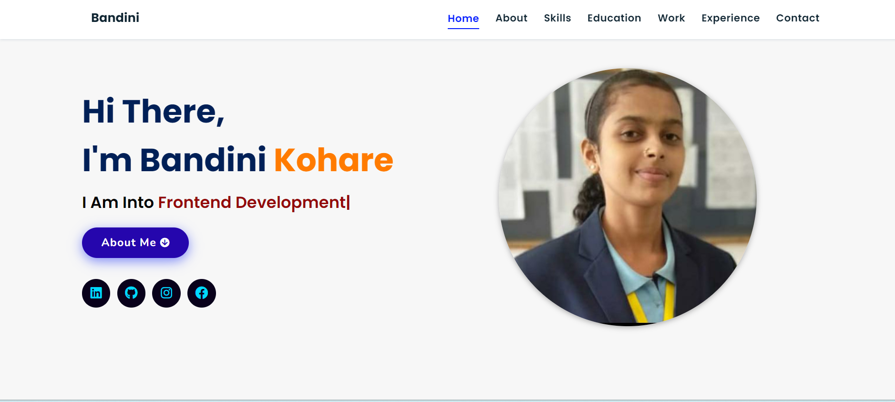

# Portfolio

**Homepage**
 

## Description
**Full Stack Developer**
 
Hello I'm Bandini Kohare.
I am a Full-Stack developer.
          I am CSE undergraduate Student.
          I am very passionate about improving my coding skills & developing applications & websites.
          I build Websites using HTML, CSS, JS, React.
          Working for myself to improve my skills.
          Love to build Websites 

 

**🚀 Why Choose Me?**
 
My journey began with a fascination for the intersection of design and functionality. Having worked with a diverse range of technologies including [Front-End Technologies] and [Back-End Technologies], I thrive on creating web applications that are not just visually appealing but also robust and efficient

